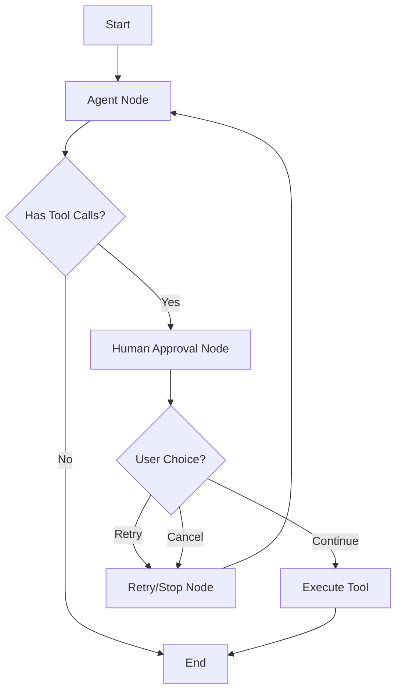

# Human-in-the-Loop Agent with LangGraph

This project demonstrates how to create a human-in-the-loop agent using LangGraph, translating the functionality from the agno library example to use LangGraph's latest `interrupt` and `Command` patterns.

## Features

- **Human-in-the-Loop Interaction**: User approval required before tool execution
- **Retry Logic**: Maximum of 3 retries with user control
- **Rich Console Output**: Beautiful terminal interface with emojis and colors
- **Tool Execution**: Three fun tools (facts, quotes, jokes) with pre-execution approval
- **State Management**: Persistent state across interruptions using LangGraph checkpointing

## Setup

1. **Install Dependencies**:

   ```bash
   pip install -r requirements.txt
   ```

2. **Environment Variables**:
   Create a `.env` file with your OpenAI API key:
   ```
   OPENAI_API_KEY=your_openai_api_key_here
   ```

## Key Translation from Agno to LangGraph

### Original Agno Concepts → LangGraph Equivalents

| Agno Concept             | LangGraph Equivalent            | Description                              |
| ------------------------ | ------------------------------- | ---------------------------------------- |
| `pre_hook`               | `human_approval_node`           | Function that runs before tool execution |
| `RetryAgentRun`          | `Command(goto="retry_or_stop")` | Retry mechanism using routing            |
| `StopAgentRun`           | `Command(goto="retry_or_stop")` | Stop execution using routing             |
| `agent.print_response()` | `agent_graph.stream()`          | Streaming execution with interrupts      |
| Agent state              | `AgentState(MessagesState)`     | Extended state with retry counters       |

### Architecture Overview



## Key Components

### 1. State Management

```python
class AgentState(MessagesState):
    retry_count: int = 0
    tool_to_execute: str = ""
    tool_args: Dict[str, Any] = {}
    user_choice: str = ""
```

### 2. Human Approval with Interrupt

```python
def human_approval_node(state: AgentState) -> Command:
    choice = interrupt({
        "question": "🤔 Do you want to continue?",
        "tool_name": tool_call['name'],
        "tool_args": tool_call['args'],
        "options": ["y", "n", "retry"],
        "default": "y"
    })
    # Handle user choice and route accordingly
```

### 3. Tool Execution

The agent includes three demonstration tools:

- `get_fact(fact: str)` - Returns interesting facts
- `get_quote(quote: str)` - Returns motivational quotes
- `get_joke(joke: str)` - Returns jokes

## Usage

Run the agent:

```bash
python main.py
```

### Interactive Flow

1. **Agent Decision**: The agent decides which tool to use based on your input
2. **Human Approval**: You're prompted to approve, retry, or cancel the tool execution
3. **Tool Execution**: If approved, the tool runs and returns formatted output
4. **Retry Logic**: Can retry up to 3 times if something goes wrong

### Example Interaction

```
🚀 Starting Human-in-the-Loop Agent
User input: Share something fun!

🤖 Agent wants to use tool: get_fact

🔍 Preparing to run: get_fact
📦 Arguments: {'fact': 'Did you know that octopuses have three hearts?'}

🤔 Do you want to continue?
Options: ['y', 'n', 'retry']
Your choice [y]: y

🤖 Agent: Here's an interesting fact: Did you know that octopuses have three hearts?
```

## Key Differences from Original Agno Code

### 1. **Graph-Based Architecture**

- LangGraph uses a state graph with defined nodes and edges
- Flow control through conditional routing instead of exceptions

### 2. **Interrupt-Based Human Interaction**

- Uses LangGraph's `interrupt()` function instead of synchronous prompts
- Supports resumption with `Command(resume=value)`

### 3. **Persistent State**

- Built-in checkpointing with `MemorySaver`
- State persists across interruptions and can be resumed later

### 4. **Message-Based Communication**

- Uses LangChain's message format (`HumanMessage`, `AIMessage`)
- Integrates with LangChain's tool calling system

## Advanced Features

### Custom Retry Logic

The retry mechanism tracks attempts and provides clear feedback:

```python
if current_retry >= MAX_RETRIES:
    console.print("❌ Maximum retries reached.")
    return Command(goto="retry_or_stop", update={"user_choice": "max_retries"})
```

### Rich Console Integration

- Colorized output with emojis
- Progress indicators for retries
- Clear formatting for tool information

### Error Handling

- Graceful keyboard interrupt handling
- Exception catching with user feedback
- Safe state management

## Production Considerations

1. **Checkpointer**: Replace `MemorySaver` with a persistent storage solution (PostgreSQL, Redis, etc.)
2. **Authentication**: Add user authentication for multi-user scenarios
3. **Tool Security**: Implement proper validation for tool inputs
4. **Logging**: Add comprehensive logging for audit trails
5. **Async Operations**: Consider async variants for better performance

## Extending the Agent

### Adding New Tools

```python
@tool
def your_custom_tool(parameter: str) -> str:
    """Your custom tool description"""
    # Tool implementation
    return result

# Add to tools list
tools = [get_fact, get_quote, get_joke, your_custom_tool]
```

### Custom Approval Logic

Modify the `human_approval_node` to implement custom approval workflows, integration with external systems, or different UI patterns.

## Dependencies

- **langgraph**: State graph framework with human-in-the-loop support
- **langchain-core**: Core LangChain functionality
- **langchain-openai**: OpenAI integration
- **python-dotenv**: Environment variable management
- **rich**: Beautiful terminal output

## License

This project demonstrates the translation from agno library patterns to LangGraph and is provided for educational purposes.
